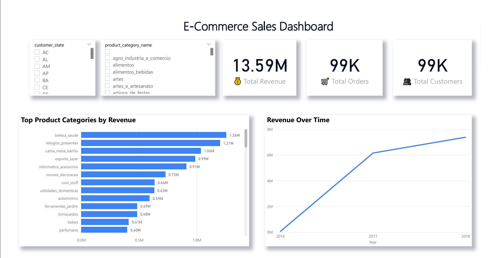

# E-Commerce Sales Dashboard (Power BI)

This project presents an interactive Power BI dashboard analyzing e-commerce sales data using the Brazilian Olist dataset.

## Dashboard Overview
The dashboard provides key insights into sales performance, customer activity, and product category trends.

### Key Metrics
- Total Revenue: 13.59M
- Total Orders: 99K
- Total Customers: 99K

### Features
- Interactive filters for customer state and product category
- Revenue trend analysis over time
- Top product categories by revenue
- KPI cards for quick business insights

## Tools Used
- Power BI
- Data Visualization
- Data Analysis

## Dataset
Brazilian E-commerce Public Dataset by Olist.

## Dashboard Preview

## Files in this Repository
- `Ecommerce_Sales_Dashboard.pbix` → Power BI dashboard file
- `Dashboard.png` → Dashboard preview image

## Author
Rakan Al-Rasheed
